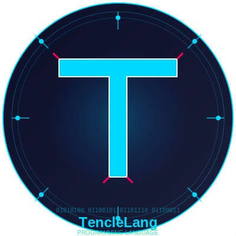

# TencleLang

<div align="center">



**A Modern Programming Language with Unique Syntax**

[](LICENSE)
[](https://github.com/CostaTech/TencleLang)
[](https://github.com/CostaTech/TencleLang)

[Features](#features) • [Installation](#installation) • [Syntax Guide](#syntax-guide) • [Examples](#examples) • [Documentation](#documentation)

</div>

---

## Table of Contents

- [About](#about)
- [Features](#features)
- [Installation](#installation)
- [Quick Start](#quick-start)
- [Syntax Guide](#syntax-guide)
  - [Variables](#variables)
  - [Operators](#operators)
  - [Print Statement](#print-statement)
  - [Conditionals](#conditionals)
  - [Loops](#loops)
  - [Functions](#functions)
  - [Classes (OOP)](#classes-oop)
  - [Importing Libraries](#importing-libraries)
- [Examples](#examples)
- [Building from Source](#building-from-source)
- [Project Structure](#project-structure)
- [Contributing](#contributing)
- [License](#license)

---

## About

**TencleLang** is a modern programming language featuring a unique and expressive syntax design. Built with Python, it offers powerful programming constructs while maintaining simplicity and readability. TencleLang files use the `.tl` extension and can integrate seamlessly with Python libraries.

**Key Characteristics:**
- Distinctive syntax using special keyword markers (`<< >>`, `< >`, `{ }`)
- Full support for object-oriented programming (classes, methods, inheritance)
- Native integration with Python ecosystem (pygame, numpy, etc.)
- Interpreted language with clear error messages
- Cross-platform compatibility (Windows executable provided)

---

## Features

### Language Features
- **Unique Syntax**: Expressive keyword system with special operators
- **Strong Typing**: Support for integers, floats, strings, lists, and custom objects
- **Object-Oriented**: Complete OOP support with classes, methods, and attributes
- **Conditionals**: `if`, `elif`, `else` statements with flexible comparison operators
- **Loops**: `while` and `for` loops with `break` (stop) and `continue` support
- **Functions**: First-class functions with parameters and return values
- **Python Integration**: Import and use any Python library seamlessly
- **Error Handling**: Clear, informative error messages with line numbers

### Development Tools
- **Standalone Interpreter**: Pre-compiled Windows executable (`tlang.exe`)
- **REPL Mode**: Interactive shell for testing code snippets
- **Debug Mode**: Built-in debugging with token and AST visualization
- **IDE Support**: Syntax highlighting available (see `docs/`)

---

## Installation

### Option 1: Pre-built Executable (Recommended)

1. Download the latest release from [GitHub Releases](https://github.com/CostaTech/TencleLang/releases)
2. Extract the archive
3. Navigate to `bin/` directory
4. Run `tlang.exe` with your `.tl` files

```bash
cd bin
tlang.exe path\to\your\program.tl
```

### Option 2: From Source

**Requirements:**
- Python 3.11 or higher
- pip (Python package installer)

**Clone the repository:**
```bash
git clone https://github.com/CostaTech/TencleLang.git
cd TencleLang
```

**Install dependencies:**
```bash
pip install -r requirements.txt
```

**Run the interpreter:**
```bash
cd src
python tlang.py path\to\your\program.tl
```

---

## Quick Start

### Hello World

Create a file named `hello.tl`:

```tlang
int << func >> ("Hello, World!")
int << func >> ("Welcome to TencleLang")
```

Run it:
```bash
tlang.exe hello.tl
```

Output:
```
Hello, World!
Welcome to TencleLang

Press ENTER to close...
```

### Interactive REPL

Launch the interactive shell:
```bash
tlang.exe
```

```tlang
>>> var x = 10
>>> int << func >> (x * 2)
20
>>> exit
```

---

## Syntax Guide

### Variables

Variables are dynamically typed and declared with the `var` keyword or directly assigned.

```tlang
var name = "TencleLang"
var version = 2.1
var active = on
var items = [1, 2, 3, 4, 5]
```

**Boolean Values:**
- `on` represents `True`
- `off` represents `False`

```tlang
var is_ready = on
var is_error = off
```

### Operators

#### Arithmetic Operators
```tlang
var a = 10 + 5      # Addition: 15
var b = 20 - 3      # Subtraction: 17
var c = 4 * 3       # Multiplication: 12
var d = 10 / 2      # Division: 5.0
var e = 10 % 3      # Modulo: 1
```

#### Comparison Operators
```tlang
5 == 5              # Equal: on
3 != 4              # Not equal: on
2 < 5               # Less than: on
7 > 3               # Greater than: on
5 <= 5              # Less or equal: on
8 >= 7              # Greater or equal: on
```

#### Logical Operators
```tlang
on and on           # AND: on
on or off           # OR: on
not on              # NOT: off
```

### Print Statement

The print statement uses the unique syntax `int << func >>`:

```tlang
int << func >> ("Hello, World!")
int << func >> (42)
int << func >> ("Sum:", 10 + 20)

var name = "Alice"
int << func >> ("Hello, " + name)
```

### Conditionals

#### If Statement
```tlang
var age = 18

<< ! >func> if age >= 18 {
    int << func >> ("Adult")
}
```

#### If-Elif-Else
```tlang
var score = 85

<< ! >func> if score >= 90 {
    int << func >> ("Grade: A")
} elif score >= 80 {
    int << func >> ("Grade: B")
} elif score >= 70 {
    int << func >> ("Grade: C")
} >> func << else {
    int << func >> ("Grade: F")
}
```

#### Nested Conditions
```tlang
var x = 10
var y = 5

<< ! >func> if x > 0 {
    << ! >func> if y > 0 {
        int << func >> ("Both positive")
    }
}
```

### Loops

#### While Loop
```tlang
var counter = 0

<<While>>! <on> counter < 5 {
    int << func >> (counter)
    counter = counter + 1
}
```

Output:
```
0
1
2
3
4
```

#### For Loop
```tlang
int < for > i in [1, 2, 3, 4, 5] {
    int << func >> (i)
}
```

#### Loop with Range
```tlang
int < for > i in range(10) {
    int << func >> ("Iteration:", i)
}
```

#### Break and Continue
```tlang
int < for > i in [1, 2, 3, 4, 5, 6, 7, 8, 9, 10] {
    << ! >func> if i == 5 {
        stop        # Break out of loop
    }
    << ! >func> if i % 2 == 0 {
        continue    # Skip even numbers
    }
    int << func >> (i)
}
```

Output:
```
1
3
```

### Functions

#### Function Definition
```tlang
<< ! C>> New command: {} greet(name) {
    int << func >> ("Hello, " + name + "!")
    int << func >> ("Welcome to TencleLang")
}

greet("Alice")
greet("Bob")
```

#### Functions with Return Values
```tlang
<< ! C>> New command: {} add(a, b) {
    returns a + b
}

<< ! C>> New command: {} multiply(x, y) {
    var result = x * y
    returns result
}

var sum = add(5, 3)
var product = multiply(4, 7)

int << func >> ("Sum:", sum)
int << func >> ("Product:", product)
```

#### Functions with Multiple Parameters
```tlang
<< ! C>> New command: {} calculate_area(width, height) {
    var area = width * height
    int << func >> ("Area:", area)
    returns area
}

var room_area = calculate_area(10, 15)
```

### Classes (OOP)

TencleLang supports full object-oriented programming with classes, methods, and attributes.

#### Basic Class Definition
```tlang
<< CRT >>! >class< Person {
    << ! C>> New command: {} __init__(self, name, age) {
        self.name = name
        self.age = age
    }
    
    << ! C>> New command: {} greet(self) {
        int << func >> ("Hello, I'm " + self.name)
        int << func >> ("I'm " + str(self.age) + " years old")
    }
    
    << ! C>> New command: {} birthday(self) {
        self.age = self.age + 1
        int << func >> ("Happy Birthday! Now " + str(self.age))
    }
}

# Create instances
var person1 = Person("Alice", 25)
var person2 = Person("Bob", 30)

# Call methods
person1.greet()
person2.birthday()
```

#### Class with Multiple Methods
```tlang
<< CRT >>! >class< BankAccount {
    << ! C>> New command: {} __init__(self, owner, balance) {
        self.owner = owner
        self.balance = balance
    }
    
    << ! C>> New command: {} deposit(self, amount) {
        self.balance = self.balance + amount
        int << func >> ("Deposited:", amount)
        self.show_balance()
    }
    
    << ! C>> New command: {} withdraw(self, amount) {
        << ! >func> if amount <= self.balance {
            self.balance = self.balance - amount
            int << func >> ("Withdrawn:", amount)
        } >> func << else {
            int << func >> ("Insufficient funds")
        }
        self.show_balance()
    }
    
    << ! C>> New command: {} show_balance(self) {
        int << func >> ("Balance:", self.balance)
    }
}

var account = BankAccount("Alice", 1000)
account.deposit(500)
account.withdraw(200)
account.show_balance()
```

### Importing Libraries

TencleLang can import and use any Python library:

```tlang
use math
use random
use datetime

# Math operations
var sqrt_value = math.sqrt(16)
var pi = math.pi
int << func >> ("Square root of 16:", sqrt_value)
int << func >> ("Pi:", pi)

# Random numbers
var random_num = random.randint(1, 100)
int << func >> ("Random number:", random_num)

# Lists
var numbers = [1, 2, 3, 4, 5]
var shuffled = random.shuffle(numbers)
```

---

## Examples

### Example 1: Calculator

```tlang
<< ! C>> New command: {} calculate(operation, a, b) {
    << ! >func> if operation == "add" {
        returns a + b
    } elif operation == "subtract" {
        returns a - b
    } elif operation == "multiply" {
        returns a * b
    } elif operation == "divide" {
        << ! >func> if b != 0 {
            returns a / b
        } >> func << else {
            int << func >> ("Error: Division by zero")
            returns 0
        }
    } >> func << else {
        int << func >> ("Unknown operation")
        returns 0
    }
}

int << func >> ("Addition:", calculate("add", 10, 5))
int << func >> ("Subtraction:", calculate("subtract", 10, 5))
int << func >> ("Multiplication:", calculate("multiply", 10, 5))
int << func >> ("Division:", calculate("divide", 10, 5))
```

### Example 2: FizzBuzz

```tlang
int < for > i in range(1, 31) {
    << ! >func> if i % 15 == 0 {
        int << func >> ("FizzBuzz")
    } elif i % 3 == 0 {
        int << func >> ("Fizz")
    } elif i % 5 == 0 {
        int << func >> ("Buzz")
    } >> func << else {
        int << func >> (i)
    }
}
```

### Example 3: Student Grade Manager

```tlang
<< CRT >>! >class< Student {
    << ! C>> New command: {} __init__(self, name, student_id) {
        self.name = name
        self.student_id = student_id
        self.grades = []
    }
    
    << ! C>> New command: {} add_grade(self, grade) {
        self.grades.append(grade)
        int << func >> ("Grade added:", grade)
    }
    
    << ! C>> New command: {} calculate_average(self) {
        << ! >func> if len(self.grades) == 0 {
            returns 0
        }
        
        var total = 0
        int < for > grade in self.grades {
            total = total + grade
        }
        
        returns total / len(self.grades)
    }
    
    << ! C>> New command: {} print_report(self) {
        int << func >> ("=== Student Report ===")
        int << func >> ("Name:", self.name)
        int << func >> ("ID:", self.student_id)
        int << func >> ("Grades:", self.grades)
        int << func >> ("Average:", self.calculate_average())
    }
}

# Usage
var student = Student("Alice Johnson", "S12345")
student.add_grade(95)
student.add_grade(87)
student.add_grade(92)
student.add_grade(88)
student.print_report()
```

### Example 4: Game Development with Pygame

```tlang
use pygame
use random

pygame.init()

var screen = pygame.display.set_mode([800, 600])
pygame.display.set_caption("TencleLang Game")

var running = on
var player_x = 400
var player_y = 300

<<While>>! <on> running {
    int < for > event in pygame.event.get() {
        << ! >func> if event.type == pygame.QUIT {
            running = off
        }
    }
    
    var keys = pygame.key.get_pressed()
    << ! >func> if keys[pygame.K_LEFT] {
        player_x = player_x - 5
    }
    << ! >func> if keys[pygame.K_RIGHT] {
        player_x = player_x + 5
    }
    << ! >func> if keys[pygame.K_UP] {
        player_y = player_y - 5
    }
    << ! >func> if keys[pygame.K_DOWN] {
        player_y = player_y + 5
    }
    
    screen.fill([0, 0, 0])
    pygame.draw.circle(screen, [255, 0, 0], [player_x, player_y], 25)
    pygame.display.flip()
}

pygame.quit()
```

---

## Building from Source

### Prerequisites

- Python 3.11 or higher
- PyInstaller 6.0 or higher
- (Optional) pygame for game development examples

### Build Instructions

1. **Clone the repository:**
   ```bash
   git clone https://github.com/CostaTech/TencleLang.git
   cd TencleLang
   ```

2. **Install dependencies:**
   ```bash
   pip install -r requirements.txt
   ```

3. **Build the executable:**
   ```bash
   cd src
   pyinstaller --onefile --name tlang tlang.py
   ```

4. **The compiled executable will be in `dist/tlang.exe`**

### Build with Libraries (e.g., pygame)

To include additional libraries in the standalone executable:

```bash
pyinstaller --onefile --name tlang --hidden-import=pygame --hidden-import=random tlang.py
```

---

## Project Structure

```
TencleLang/
├── bin/                    # Compiled executables
│   └── tlang.exe          # Standalone interpreter
├── src/                    # Source code
│   ├── tlang.py           # Main interpreter entry point
│   ├── lexer.py           # Tokenizer/Lexer
│   ├── tlang_parser.py    # Parser (AST generation)
│   ├── interpreter.py     # Interpreter/Executor
│   └── config.py          # Language configuration
├── examples/               # Example programs
│   ├── hello_world.tl
│   ├── calculator.tl
│   ├── fizzbuzz.tl
│   ├── oop_demo.tl
│   └── pygame_demo.tl
├── docs/                   # Documentation
│   ├── SYNTAX.md          # Complete syntax reference
│   ├── API.md             # API documentation
│   └── TUTORIAL.md        # Step-by-step tutorial
├── README.md              # This file
├── LICENSE                # MIT License
└── requirements.txt       # Python dependencies
```

---

## Documentation

### Complete Syntax Reference

For a complete syntax reference, see [docs/SYNTAX.md](docs/SYNTAX.md).

### Language Keywords

| Keyword | Description | Example |
|---------|-------------|---------|
| `var` | Variable declaration | `var x = 10` |
| `int << func >>` | Print statement | `int << func >> ("Hello")` |
| `<< ! >func> if` | If statement | `<< ! >func> if x > 5 { }` |
| `elif` | Else if | `elif x < 0 { }` |
| `>> func << else` | Else statement | `>> func << else { }` |
| `<<While>>! <on>` | While loop | `<<While>>! <on> x < 10 { }` |
| `int < for >` | For loop | `int < for > i in list { }` |
| `<< ! C>> New command: {}` | Function definition | `<< ! C>> New command: {} func() { }` |
| `<< CRT >>! >class<` | Class definition | `<< CRT >>! >class< Name { }` |
| `returns` | Return value | `returns value` |
| `stop` | Break loop | `stop` |
| `continue` | Continue loop | `continue` |
| `use` | Import module | `use pygame` |
| `on` | Boolean true | `var flag = on` |
| `off` | Boolean false | `var flag = off` |

### Command-Line Options

```bash
# Run a TencleLang program
tlang.exe program.tl

# Interactive REPL mode
tlang.exe

# Debug mode (shows tokens and AST)
tlang.exe -d program.tl

# Show help
tlang.exe --help
```

---

## Contributing

Contributions are welcome! Here's how you can help:

### Reporting Issues

If you find a bug or have a feature request:
1. Check if the issue already exists in [GitHub Issues](https://github.com/CostaTech/TencleLang/issues)
2. If not, create a new issue with:
   - Clear description of the problem
   - Steps to reproduce (for bugs)
   - Expected vs actual behavior
   - TencleLang version and OS

### Submitting Changes

1. Fork the repository
2. Create a feature branch:
   ```bash
   git checkout -b feature/your-feature-name
   ```
3. Make your changes following the code style
4. Test your changes thoroughly
5. Commit with clear messages:
   ```bash
   git commit -m "Add feature: description"
   ```
6. Push to your fork:
   ```bash
   git push origin feature/your-feature-name
   ```
7. Open a Pull Request with:
   - Clear description of changes
   - Any related issue numbers
   - Test results

### Development Guidelines

- Follow existing code style and conventions
- Add tests for new features
- Update documentation for syntax changes
- Keep commits focused and atomic
- Write clear commit messages

---

## License

This project is licensed under the MIT License. See the [LICENSE](LICENSE) file for full details.

```
MIT License

Copyright (c) 2025 CostaTech

Permission is hereby granted, free of charge, to any person obtaining a copy
of this software and associated documentation files (the "Software"), to deal
in the Software without restriction, including without limitation the rights
to use, copy, modify, merge, publish, distribute, sublicense, and/or sell
copies of the Software, and to permit persons to whom the Software is
furnished to do so, subject to the following conditions:

The above copyright notice and this permission notice shall be included in all
copies or substantial portions of the Software.

THE SOFTWARE IS PROVIDED "AS IS", WITHOUT WARRANTY OF ANY KIND, EXPRESS OR
IMPLIED, INCLUDING BUT NOT LIMITED TO THE WARRANTIES OF MERCHANTABILITY,
FITNESS FOR A PARTICULAR PURPOSE AND NONINFRINGEMENT.
```

---

## Links

- **Repository**: [github.com/CostaTech/TencleLang](https://github.com/CostaTech/TencleLang)
- **Issues**: [github.com/CostaTech/TencleLang/issues](https://github.com/CostaTech/TencleLang/issues)
- **Releases**: [github.com/CostaTech/TencleLang/releases](https://github.com/CostaTech/TencleLang/releases)
- **Documentation**: [github.com/CostaTech/TencleLang/tree/main/docs](https://github.com/CostaTech/TencleLang/tree/main/docs)

---

## Acknowledgments

**TencleLang** is developed and maintained by CostaTech.

Special thanks to:
- The Python community for the excellent tools and libraries
- PyInstaller for making distribution easy
- All contributors who help improve TencleLang

---

<div align="center">

**TencleLang v2.1** - A Modern Programming Language

[Back to Top](#tenclelang)

</div>
